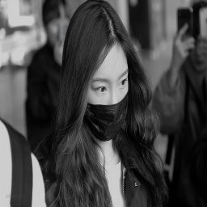

# YOLOFace


This code is taken from the repo [here](https://github.com/sthanhng/yoloface). I just change  codes for making face extractor.

## Prerequisites

* Tensorflow
* opencv-python
* opencv-contrib-python
* Numpy
* Keras
* Matplotlib
* Pillow
* tqdm

Development for this project will be isolated in Python virtual environment. This allows us to experiment with different versions of dependencies.

There are many ways to install `virtual environment (virtualenv)`, see the [Python Virtual Environments: A Primer](https://realpython.com/python-virtual-environments-a-primer/) guide for different platforms, but here are a couple:

- For Ubuntu
```bash
$ pip install virtualenv
```

- For Mac
```bash
$ pip install --upgrade virtualenv
```

Create a Python 3.6 virtual environment for this project and activate the virtualenv:
```bash
$ virtualenv -p python3.6 yoloface
$ source ./yoloface/bin/activate
```

Next, install the dependencies for the this project:
```bash
$ pip install -r requirements.txt
```

## Usage

* Clone this repository

* For face detection, you should download the pre-trained YOLOv3 weights file which trained on the [WIDER FACE: A Face Detection Benchmark](http://mmlab.ie.cuhk.edu.hk/projects/WIDERFace/index.html) dataset from this [link](https://drive.google.com/file/d/1xYasjU52whXMLT5MtF7RCPQkV66993oR/view?usp=sharing) and place it in the `model-weights/` directory.

* Run the following command:

>**image input**
```bash
$ python yoloface.py --image samples/outside_000001.jpg --output-dir outputs/
```

## Sample input



## Sample outputs


Also code support multiple face extraction

